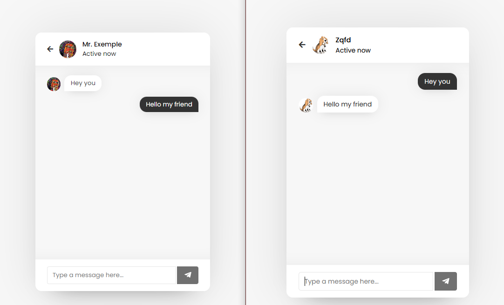

# Blocus Chatroom beta-2.0.5-nightly

    

Instant server side encrypted messaging app with HTML/CSS JavaScript and PHP: Make the Internet free again!

## Features

- Sign up without phone number and without mail.
- No ads, no trackers, no analytics.
- All messages are encrypted with AES-256-CTR into the databse.
- All messages are deleted after 24h.
- User-friendly admin interface (manage database, users, etc.)
- Android-friendly UI
- Easy config on an apache/PHP/MySQL webserver

- Even more coming soon (Contacts, persistant area, proxies, etc)

## Thanks to contributors

- [G-team](https://glitcher.me)

- [You?](https://github.com/blocus-org/blocus-chatroom/contribute.md)

## How to use
- Go visit the official instance [chatroom.blocus.ch](https://chatroom.blocus.ch)
- Download the [android app](https://github.com/blocus-org/blocus-chatroom-android/tags) (Alpha)

## How to host

You need to setup an apache/php/mariadb webserver
- [Linux](#linux)
- [Windows](#windows) (soon)
- [Web server already setup](#config)

## <a name='linux'>Linux</a>

[Here](https://www.digitalocean.com/community/tutorials/how-to-install-linux-apache-mariadb-php-lamp-stack-on-debian-11) 's a complete tutorial for setting up your own php/mysql/apache webserver .  Made by digital ocean for Debian 11.

## <a name='config'> Web server is setup</a>

- Open the config file (php/config.php)
- Set username and password for database
- Change the encryption key with another autogenerated 256bit key
- Create database (same name as you choosed in config.php)
- Put all files in your webserver root
- Import .sql file with adminer (blocus_chat_db.sql) (http://your-server.adress/adminer.php)
- Visit https://your-web-server.adress.com/update.php to check requirements and create your admin account
- You are all done! Visit https://your-web-server.adress.com/

